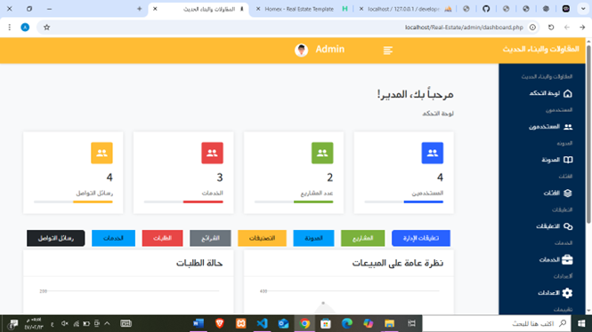
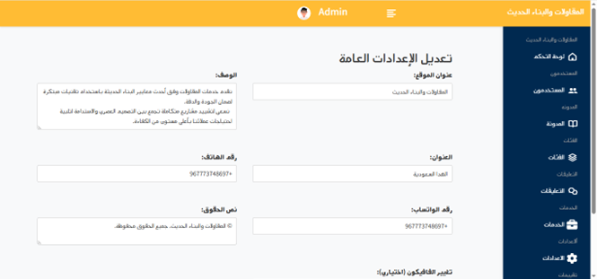
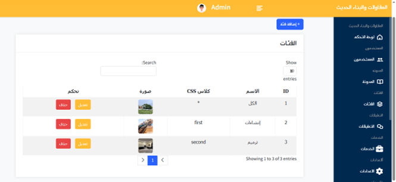
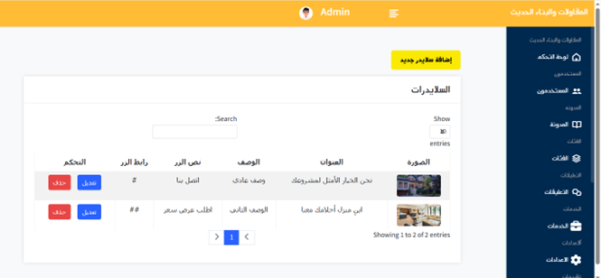
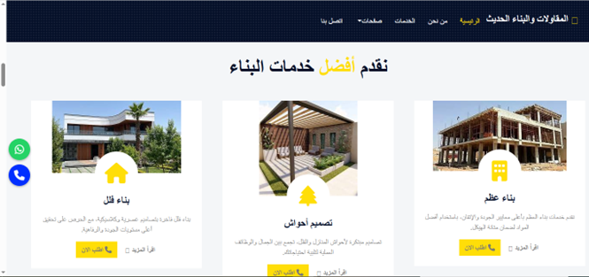
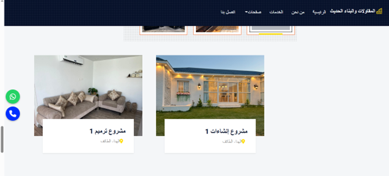

# موقع المقاولات والبناء والتشطيب

هذا المشروع هو نظام متكامل لإدارة خدمات المقاولات والبناء والتشطيب وأعمال الأحواش، يحتوي على:

- لوحة تحكم للإدارة
- نظام تسجيل دخول آمن
- إدارة الفئات والمشاريع والصور
- قاعدة بيانات MySQL
- مبني بلغة PHP

---

## 🔐 صفحة تسجيل الدخول للوحة التحكم

رابط لوحة التحكم للإدارة:  
[http://localhost/Real-Estate/admin/index.php](http://localhost/Real-Estate/admin/index.php)

---

## 🖼️ صور من النظام

### 1. صفحة تسجيل الدخول

### 2. لوحة التحكم الرئيسية

### 3. الاعدادات

### 4. إدارة المشاريع

### 5. عرض تفاصيل المشروع

### 6.اضافه شرائح

### 7. من نحن

### 8.   الفئات

### 9.الخدمات 

### 10. معرض الأعمال

---

## 🛠️ التقنيات المستخدمة

- PHP 8+
- MySQL
- HTML / CSS / Bootstrap
- نظام رفع صور
- CRUD كامل للمشاريع والفئات

---

## 📁 مجلد الصور في GitHub

